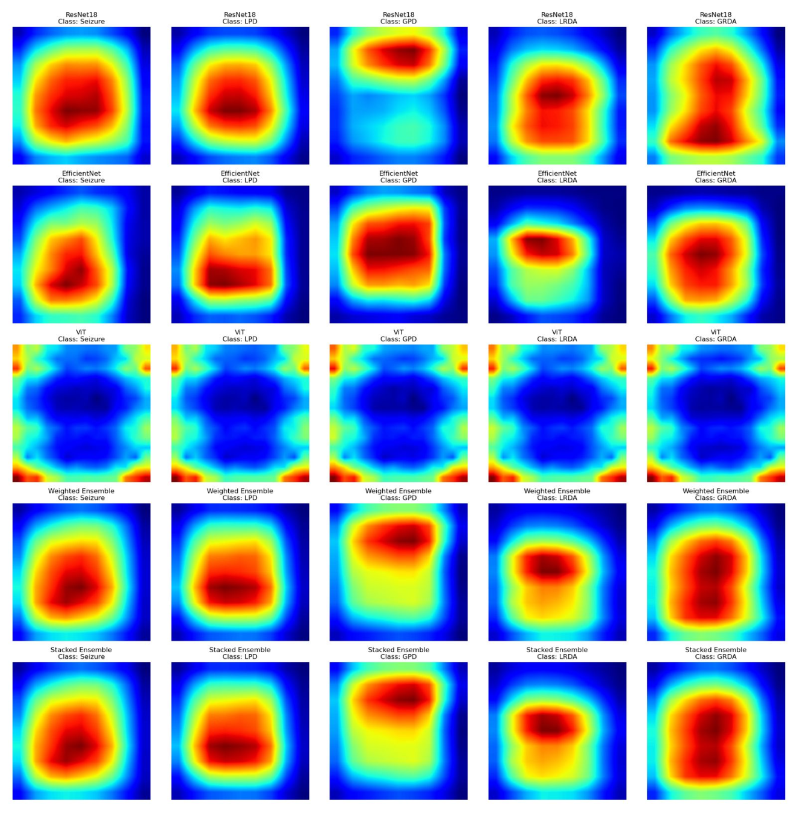

## **EEG-based Harmful Brain Activity Classification using Deep Learning**

 
- **Dataset** 
  This project is primarily based on the Kaggle competition “HMS - Harmful Brain Activity Classification” ([link](https://www.kaggle.com/competitions/hms-harmful-brain-activity-classification)). The datasets used in this project were provided through the competition. 

- **Process**
  - Applied and evaluated ML models(**ResNet18, EfficientNet, ViT**, and an **ensemble approach**) to detect harmful brain symptoms(Seizure, LPD, GPD, LRDA, GRDA) from EEG data.
  - Preprocessed multi-channel EEG into **scalogram images**, trained a multi-class classifier to distinguish neurological event types.
  - Achieved over **74%** test accuracy with the ensemble model across five harmful brain activities using a scalogram-based input representation, mainly utilising PyTorch and scikit-learn.
  - For better interpretability of by applying **Grad-CAM** to visualise decision patterns, supporting a clear explanation of neurological signals to non-experts.

  

- **Limitations** 
  - Grad-CAM is not designed to work with ViT. As shown in the Grad-CAM image, it fails to highlight the activated regions of the brain when interpreting ViT outputs. Applying other methods could have been helpful for more explainable result.



