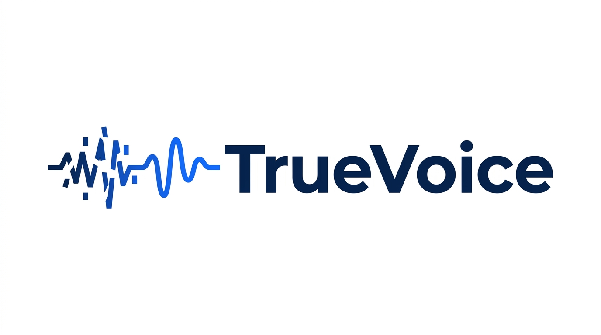

## **TrueVoice — Detecting AI Voice-Cloning Scams with Gemma 4**
 



  

### Winner — Safety & Trust Track
Built for the **Gemma 4 Good Hackathon** (Google DeepMind × Kaggle; $200K prize pool, 5 impact tracks) as a 2-person team, TrueVoice won the **Safety & Trust** track.

### Why This Matters
Voice cloning has legitimate uses, but the barrier to misuse is collapsing: a convincing clone now needs only a few seconds of public audio and a free tool. AI-powered voice-phishing caused over $5M in documented US losses in 2025, and the FBI attributes hundreds of millions more to AI-enabled scams. Enterprise anti-spoofing systems are expensive and API-locked; research systems aren't deployable. **TrueVoice fills that gap** — a browser-accessible detector that needs no install, no account, and no technical expertise, aimed at the people most targeted (e.g. the elderly).

### How It Works
Gemma 4 E4B ships with a dedicated multimodal **audio encoder**. TrueVoice repurposes it as a feature extractor for anti-spoofing — a task it was never trained for.

- Raw audio → mel spectrogram → **frozen** Gemma 4 audio tower → 1536-dim representation (mean-pooled)
- A lightweight classification head on top: `Linear(1536→256) → GELU → Dropout → Linear(256→2)`
- The **entire backbone is frozen**; only a **1.5MB** head is trained. This shows Gemma 4's pretrained audio representations generalise to security-critical tasks without fine-tuning — and keeps inference fast enough for the web.

### The Key Insight: Codec Simulation
Anti-spoofing models trained on studio-quality audio fail on real phone calls, because they learn to judge *audio quality* rather than genuine synthesis artifacts. TrueVoice applies **codec simulation** — downsampling training audio to 8kHz and back — forcing the model to learn the acoustic signatures of synthetic speech instead. This was the single most consequential design decision.

### Results
Evaluated on the full **ASVspoof 2021 LA** eval set (148,176 samples):

| Metric | Score |
| --- | --- |
| EER (Equal Error Rate) | 5.20% |
| Overall accuracy | 96% |
| Fake recall / precision | 96% / 0.99 |
| Real recall | 93% |

Reaching 5.20% EER with a **frozen backbone and a 1.5MB head** demonstrates the quality of Gemma 4's audio representations as a general-purpose feature extractor.

### The Demo
TrueVoice runs as a **Gradio web app** in any browser. A user receiving a suspicious call can record it or upload audio and get a verdict in seconds — no install, no account. A "Phone Call Simulation Mode" applies 8kHz codec processing to mimic real phone conditions.

### What's Next
- Telecom API integration for passive call screening at the network level
- On-device inference (Gemma 4 E2B) for fully offline, private detection
- Expansion beyond English — voice phishing is global, and many high-risk groups speak under-represented languages

### Tech Stack
- **Model:** Gemma 4 E4B (`google/gemma-4-e4b-it`), frozen audio tower
- **Training:** Google Colab A100, Hugging Face Transformers
- **Data:** ASVspoof 2019 LA (train) + 2021 LA (eval)
- **Demo:** Gradio (browser-accessible)
- **Classifier size:** 1.5MB · **Inference:** ~2s per clip
